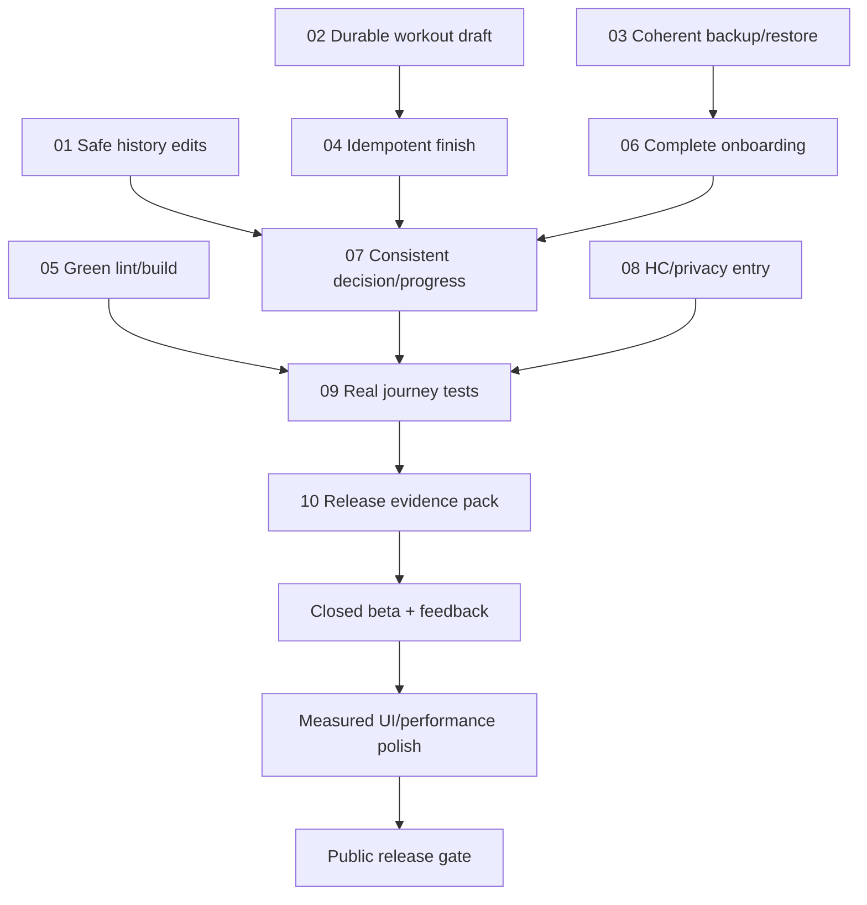

# Development Roadmap

Версія 2026-09-19. План за результатами [PROJECT_AUDIT](PROJECT_AUDIT.md),
кодова база `184c0044718e22b97d01cee20f0da707a355c8bc`.
Це план наступних змін, **не перелік уже виконаних виправлень**.
У поточній задачі створено карту/аудит/правила; Kotlin, Gradle, Room schema та UI не змінювалися.

## Ціль

Не «ідеально по всіх уявних параметрах», а якісний вузький продукт:
нова людина без сторонньої допомоги отримує зрозумілу доречну дію сьогодні, виконує її,
не втрачає записи, бачить справжній прогрес і знає, що робити наступного разу.
Anime HUD підтримує цю цінність. AI не є умовою її отримання.

Порядок: data integrity -> first usable loop -> decision trust -> verified beta -> measured polish.
Роботи не потребують реорганізації всіх modules або нового технологічного стеку.

## Правила виконання

- Перед task: GRAPH_REPORT -> відповідний рядок FEATURE_MAP -> playbook -> вузький code path.
- Один task/PR має одну перевірну мету; не змішувати data fix з масовою зміною кольорів/залежностей.
- Regression test спочатку демонструє помилку, після fix проходить; source regex недостатньо для data correctness.
- Domain володіє правилами, data володіє persistence, ViewModel володіє UI state, Compose передає events.
- Не прибирати logging/editing/actions для спрощення тесту. Не виправляти через wipe або silent reset.
- Room change: entity/DAO/version/migration/exported schema/backup compatibility/tests як одна робота.
- Release AI disabled лишається повністю корисним; ValidateDirectivesUseCase залишається mutation gate.
- UI тільки Kotlin/Compose; visuals через SystemTheme/SystemPanel/techSurface/shared controls.
- Після зміни контракту оновлювати map, після закриття AUD-ID додавати evidence, не переписувати аудит як історію успіху.
- Не пушити/мерджити автоматично без відповідного запиту.

Оцінки: **S** = приблизно 0.5-1 інженерний день, **M** = 1-3 дні, **L** = 3-7 днів.
Це діапазони для однієї людини з доступним Android device; включають вузькі tests/review,
не включають очікування feedback/Play review. Не сумувати їх у гарантований release date.
Незнайомі bugs можуть змінити оцінку після першого regression test.

## Залежності

Lint можна виправити раніше як незалежний короткий task. Номери не означають, що все треба
виконувати послідовно; storage/session контракти слід узгодити до паралельних змін у WorkoutViewModel.

## Перші десять задач

### 01. Безпечне редагування workout history

**P0, M. Закриває AUD-01.** Без залежностей.

Файли: `domain/src/main/java/com/ihor/thesystem/domain/usecase/LogWorkoutSetsUseCase.kt`,
`domain/src/main/java/com/ihor/thesystem/domain/usecase/StatisticsUseCases.kt`,
`domain/src/main/java/com/ihor/thesystem/domain/repository/WorkoutAnalyticsRepository.kt`,
`app/src/main/java/com/ihor/thesystem/data/repository_impl/ProgressionMatrixRepositoryImpl.kt`,
`app/src/main/java/com/ihor/thesystem/data/local/room/dao/WorkoutAnalyticsDao.kt`.

Зміна: зробити explicit session+exercise edit contract, update parent без REPLACE,
replace тільки sets цільової вправи, перерахувати aggregate всього session.
Не вибирати довільну першу session дня, коли того дня їх кілька. Обидва наявні edit paths
мають використовувати однаковий контракт; абстракцію додавати лише для фактичного усунення дублювання.

Приймання: після edit B зберігаються A/C, session identity/date/quest linkage; повтор edit не
дублює сети; два workouts за день не змішуються; bodyweight/time/distance не зникають.
Tests: розширити `LogWorkoutSetsUseCaseTest`; додати Room integration для multi-exercise та CASCADE.
Gate: targeted tests + check-tests + check-room; schema migration тільки за реальної зміни schema.

### 02. Workout draft, що переживає переривання

**P0, L. Закриває AUD-02.** Узгодити session identity із task04.

Файли: `app/src/main/java/com/ihor/thesystem/feature/status/viewmodel/WorkoutViewModel.kt`,
`app/src/main/java/com/ihor/thesystem/feature/cycle/ui/CycleScreen.kt`,
`app/src/main/java/com/ihor/thesystem/core/ui/RefreshOnResume.kt`,
`domain/src/main/java/com/ihor/thesystem/domain/model/` і `repository/` для нового draft contract,
Room database/DAO/schema за обраним способом persistence.

Зміна: refresh не очищає поточні edits; draft має стабільний ID, дату, план і completion flags;
durable checkpoint не є завершеним workout. Визначити explicit resume/discard/finish та midnight policy.
SavedStateHandle лишити для UI details; основні сети не покладати тільки на пам'ять процесу.

Приймання: home/resume, rotate, process recreation і system dialog не стирають edits;
draft не додає XP/tonnage/statistics; explicit discard не зачіпає історію; rollover не губить старий draft.
Tests: ViewModel lifecycle + Room round-trip + реальний process-death journey на test installation.
Gate: check-tests, check-room, compile/connected relevant tests. Ніколи не тестувати wipe на єдиній копії даних.

### 03. Єдиний контракт backup/restore і setup state

**P0, L. Закриває AUD-04.** Врахувати draft format task02.

Файли: `domain/src/main/java/com/ihor/thesystem/domain/usecase/BackupUseCases.kt`,
`app/src/main/java/com/ihor/thesystem/data/repository_impl/BackupRepositoryImpl.kt`,
`BackupImportPolicy.kt` та `OnboardingRepositoryImpl.kt` у тій самій директорії,
`app/src/main/java/com/ihor/thesystem/feature/status/viewmodel/WorkoutViewModel.kt`,
`app/src/main/res/xml/full_backup_content.xml`, `app/src/main/res/xml/data_extraction_rules.xml`,
`PRIVACY_POLICY.md`.

Рішення перед кодом: для beta рекомендовано явний **повний snapshot restore** з preview та confirmation,
а не generic table merge. Це пропозиція контракту: якщо потрібен merge, спочатку визначити ID/conflict rules.
Сам restore не має дозволяти частковий payload, що випадково стирає дітей parent-row.

Зміна: consistent export transaction; format/schema compatibility, table uniqueness/completeness,
references, finite numeric/domain bounds і file-size limits; parsing поза Main; timestamp тільки після
успішного SAF write. Узгодити prefs/Room restoration та route readiness; avatar переносити лише якщо доступний.

Приймання: export -> restore у порожню test DB еквівалентний за сутностями; повтор restore має визначену
семантику; malformed/oversized/incompatible/subset file не змінює DB; failure всередині transaction
відкочується; prefs-only restore не пропускає необхідний setup; cancel не пише нічого.
Tests: BackupUseCasesTest, BackupImportPolicyTest + нові реальні Room export/import tests + SAF failure fake.
Gate: check-tests/check-room; privacy/UI copy відповідають поведінці.

### 04. Ідемпотентне завершення й незалежний report

**P1, M-L. Закриває AUD-03.** Після draft identity task02.

Файли: `app/src/main/java/com/ihor/thesystem/feature/status/viewmodel/WorkoutViewModel.kt`,
`domain/src/main/java/com/ihor/thesystem/domain/usecase/FinalizeSessionUseCase.kt`,
`domain/src/main/java/com/ihor/thesystem/domain/usecase/CompleteQuestUseCase.kt`,
`app/src/main/java/com/ihor/thesystem/data/local/room/dao/WorkoutAnalyticsDao.kt`,
session entity/schema за потреби.

Зміна: стабільний operation/session ID + storage uniqueness; UI busy state; transaction для canonical
completed result; enrichment/report retry не повторює log/XP. Після commit показати локальний report,
навіть коли optional AI/directives stage недоступний. Не переносити validation у Compose.

Приймання: подвійний tap/event, retry після timeout, process death після commit дають один session
і не більше однієї quest reward; наступний справжній workout дозволений; incomplete sets лишаються incomplete.
Tests: FinalizeSessionUseCaseFallbackTest, CompleteQuestUseCaseTest + transactional duplicate/retry tests.
Gate: check-tests + відповідні Room tests.

### 05. Повернути зелений lint без suppression

**P1, S. Закриває AUD-08.** Незалежно від data tasks.

Файли: `app/src/main/java/com/ihor/thesystem/feature/statistics/ui/components/TonnageChartCanvas.kt`,
тести форматування; `.github/workflows/android-ci.yml` тільки якщо треба виправити evidence publication.

Зміна: observable locale у Composable; числові/dates machine formats лишити locale-stable;
відокремити UI locale від storage/protocol locale. Triage warnings, не mass-update dependencies.

Приймання: `:app:lintDebug` без errors; change locale після відкриття екрана оновлює formatting;
uk/en та comma decimal input не ламають logs. Warnings задокументовані за пріоритетом.
Gate: compileDebugKotlin + relevant formatting tests + lintDebug + bundleRelease.

### 06. Onboarding створює першу корисну дію

**P1, M-L. Закриває AUD-05.** Після визначення setup/restore invariant task03.

Файли: `domain/src/main/java/com/ihor/thesystem/domain/model/Onboarding.kt`,
`domain/src/main/java/com/ihor/thesystem/domain/usecase/OnboardingUseCases.kt`,
`domain/src/main/java/com/ihor/thesystem/domain/repository/Repositories.kt` (ScheduleRepository),
`app/src/main/java/com/ihor/thesystem/feature/onboarding/viewmodel/OnboardingViewModel.kt`,
`app/src/main/java/com/ihor/thesystem/core/navigation/AppEntryViewModel.kt`.

Зміна: невеликий набір перевірених starter cycles, equipment substitutions, явні rest days;
setup commits лише після готовності каталогу/config/program. Retry не скидає вже створений прогрес.
Goal/experience зберігати явно, якщо вони потрібні для майбутніх рішень, а не виводити назад з XP.

Приймання: чиста установка -> setup -> Status з коректним next action -> реальний workout,
без ручного конструктора; offline; повторний launch без route flash; failure/retry без partial setup.
Tests: OnboardingUseCasesTest + clean-install integration з seed/schedule/decision.
Контент стартових програм має пройти review компетентного фахівця з тренувань; LLM не є таким доказом.

### 07. Єдина семантика Today Order, quests і progress

**P1, L. Закриває AUD-06/07/10.** Після reliable logs і starter schedule.

Файли: `domain/src/main/java/com/ihor/thesystem/domain/usecase/DecideTodayWorkoutUseCase.kt`,
`GenerateDailyQuestsUseCase.kt`, `AdjustWorkoutRecommendationUseCase.kt` у тій самій директорії,
`app/src/main/java/com/ihor/thesystem/feature/status/viewmodel/TodayOrderUiMapper.kt`,
`app/src/main/java/com/ihor/thesystem/data/local/room/dao/WorkoutAnalyticsDao.kt`, readiness contract/UI state.

Зміна: typed reasons/provenance/freshness замість string matching; unknown/stale не виглядає виміряним;
REST не створює phantom MAIN; completed quests не регенеруються як нові; progress queries рахують
тільки відповідну виконану роботу. Додати мінімальний optional daily check-in для вже використаних signals.
Не розширювати task до повноцінної nutrition системи.

Приймання: таблиця training/recovery/deload/no-excuse/rest однакова на Status, Cycle, Calendar і report;
відсутні/старі дані позначені; calendar OFF не дає нульового workout quest; зміна readiness без restart
оновлює decision; incomplete100kg не перевершує completed40kg; правила не тиснуть тренуватися через біль.
Tests: decision/generation/mapper/readiness/query tests + cross-feature fixtures + concurrent rollover case.
Експертна оцінка безпечності контенту/правил окрема від automated tests.

### 08. Health Connect та privacy як завершена інтеграція

**P1, M. Закриває AUD-09.** Не чекати AI або monetization.

Файли: `app/src/main/AndroidManifest.xml`,
`app/src/main/java/com/ihor/thesystem/health/HealthConnectPermissions.kt`,
`app/src/main/java/com/ihor/thesystem/data/repository_impl/HealthConnectSignalsRepositoryImpl.kt`,
native rationale screen/Activity, `docs/HEALTH_CONNECT_RATIONALE.md`, `PRIVACY_POLICY.md`, `STORE_LISTING.md`.

Зміна: privacy rationale intent і Android14+ alias, узгоджена hosted policy; permission checks після revoke;
перевірена семантика sleep window/overlap/source aggregation. Лише READ_SLEEP.

Приймання: policy відкривається із HC permission UI, deny/provider-missing не блокують core loop;
sleep з кількох джерел не подвоюється; ніч через midnight не пропадає; stale signal позначений.
Tests: repository time/source fixtures, system intent resolution та device permission lifecycle.
Public policy URL/contact і Play Console декларації заповнює власник; їх не можна вигадувати.

### 09. Справжні integration journeys замість лише test-shell

**P1, L. Закриває AUD-11.** Після tasks01-08, smoke skeleton можна почати раніше.

Файли: `app/src/androidTest/java/com/ihor/thesystem/ui/ResponsiveLayoutTest.kt`,
`app/src/androidTest/java/com/ihor/thesystem/data/local/room/database/AppDatabaseMigrationTest.kt`,
`app/src/main/java/com/ihor/thesystem/core/navigation/AppNavGraph.kt`, `.github/workflows/android-ci.yml`.

Зміна: real navigation + controlled repositories/test DB, stable semantic tags; onboarding -> Today ->
Cycle -> log -> finish -> Statistics -> restart; UI actions не підміняються порожніми RouteContent.
Окремо instrumented Room data tests, щоб FK/REPLACE поведінка перевірялася на SQLite.
Додати один зрозумілий connected smoke job без дорогої матриці; повні device/performance runs окремим gate.

Приймання: усі5 tabs на360x640 і normal phone, font1.0/1.3, CTA reachable, IME/insets не приховують
finish, vertical scroll не міняє mode/tab, horizontal gesture має однозначного owner, back коректний.
font2.0/TalkBack/reduced motion перевірити для public gate; visual clipping оцінювати screenshots,
а не одним assertIsDisplayed. Release no-AI journey проходить offline.
Gate: connected tests + screenshot evidence + check-tests/check-web-ui-guard + compile.

### 10. Верифікований release candidate і beta пакет

**P1, M.** Після tasks01-09. Ця робота не означає автоматичний push або Play submission.

Файли: `app/build.gradle.kts`, `.github/workflows/android-ci.yml`, `README.md`,
`PRIVACY_POLICY.md`, `STORE_LISTING.md`, `MVP_DEFINITION.md`, `PRODUCT_STRATEGY.md`,
`docs/SCREENSHOTS_CHECKLIST.md`, `docs/HEALTH_CONNECT_RATIONALE.md`.

Зміна: прибрати stale readiness claims у документах, перевірити actual release key/permissions/network,
підготувати owner-controlled signing поза repo, archive checksum/version/report bundle, policy URL,
asset license inventory і потрібні Console декларації. Перевірити native16KB support для фактичного artifact.
Розмежувати discovery5-10 людей і формальний closed testing requirement конкретного account.

Приймання: всі applicable gates нижче зелені або є явно погоджений non-blocking exception;
жодного P0/P1 core defect; signed candidate встановлюється, launches offline, backup round-trip проходить.
Публічні screenshots з реального candidate, не концептуальні картинки. У release немає raw errors чи Gemini key.

## Beta gates

### До зовнішньої beta

- AUD-01/02/04 закриті regression+integration tests; дані не втрачаються на edit/resume/import.
- Finish і rollover повторювані без дублювання logs/XP; canonical completion не залежить від AI.
- Чисте встановлення без HC/мережі дає придатний план; first launch route не мерехтить.
- Today reason/CTA відповідають створеним tasks; unknown readiness видно; rest не карається помилково.
- Повний unit suite, Room guards, web-UI guard, compile, lint і release bundle проходять.
- Room migration і backup round-trip перевірені на test device; основний real UI journey зелений.
- Privacy/HC integration відповідають shipped behavior; known issues список не містить data-loss/safety blockers.
- Є recovery/support шлях для tester, version/build ID у feedback; дані тестера не стираються без його явної дії.

### До public release

- Позитивний beta feedback про core task, а не тільки screenshots; усі blocker regressions закриті.
- Play Console account-specific requirements, health/Data Safety/content/target audience completed;
  public policy URL/contact, screenshots, signing та versioning перевірені власником.
- API36 edge-to-edge/back/adaptive behavior та16KB native compatibility підтверджені на candidate.
- Font scaling/TalkBack, process death, offline, revoked permissions, long history, midnight/timezone пройдені.
- Виміряні current startup/frame/battery results на representative device; немає відомих регулярних freezes/ANRs.
- Support/privacy deletion/export paths задокументовані; немає unsupported medical claims чи неперевірених прав на assets.
- Якщо є платежі: purchase/restore/refund/offline entitlement tests і актуальна перевірка Play Billing policy.
  До появи платежів цей gate не застосовується; не додавати billing заради чекліста.

## Beta як навчання

Спочатку5-10 discovery testers з цільової аудиторії для usability. За застосовного Play rule потрібна
окрема достатня closed-testing група; актуальний account-specific мінімум дивись в audit і Console.
Не називати цю невелику вибірку статистичним доказом product-market fit.

| Питання | Подія / вимір | Початковий критерій рішення, не індустріальний benchmark |
| --- | --- | --- |
| Чи ясна цінність? | Людина своїми словами пояснює Today action/reason | 4 з5 usability participants без підказки; інакше змінити copy/flow |
| Чи швидкий старт? | setup start -> перший actionable order; перший logged set | медіана до першого плану <=3 хв як початкова ціль; облік проблем окремо |
| Чи не дратує logging? | task success, taps, помилки вводу | звичайний planned set completion одним tap; будь-яке виправлення доступне |
| Чи можна довіряти даним? | sessions before/after interruption/import/edit | нуль втрат/дублів у deterministic stress suite; не відсоткова поблажка |
| Чи повертаються? | distinct active dates, second session, W2/W4 cohort | збирати counts+reasons; не вигадувати «норму retention» з малої групи |
| Чи корисні рекомендації? | accepted/adjusted/declined + optional reason | фіксувати невідповідності, спочатку виправляти правила/дані |
| Чи потрібна оплата? | добровільні інтерв'ю та конкретна offer hypothesis | довести recurring value перед subscription implementation |

Local event contract: event version, local date/zone, stable operation ID, source decision type,
onboarding/first-workout timestamps; без raw health fields у diagnostic export.
Не прирівнювати app refresh до корисної дії. Weekly planned completion зв'язувати зі snapshot плану,
а не поточним зміненим schedule. Export summary тільки добровільний, з preview, без third-party SDK за замовчуванням.
Entry files: `domain/src/main/java/com/ihor/thesystem/domain/usecase/BetaMetricsAggregator.kt`,
`GetBetaMetricsUseCase.kt` та `app/src/main/java/com/ihor/thesystem/data/repository_impl/BetaMetricsRepositoryImpl.kt`.

## Після стабілізації

### Performance pass, M-L

Використати існуючий `:baselineprofile`, а не створювати ще один. Зафіксувати device/API/refresh rate,
build/minification/compilation mode/dataset/thermal state; щонайменше10 валідних samples для startup,
повторювані journeys для frame metrics. First-install, cold, warm та time-to-usable-Today вимірювати окремо.
Старий benchmark не використовувати як before для нового device/build.

Початкові внутрішні budgets, що треба підтвердити реалістичністю на Realme: cold usable p50<=1.5s,
p95<=2.5s; steady-state scroll без повторюваних slow frames, ціль jank<5% за фіксованою методикою;
жодного регулярного freeze. Це наші цілі, не цитата Android Vitals і не вже досягнутий результат.
Перший запуск із seed має окремий budget після baseline; показати чесну readiness state без route flash.
Optimize тільки trace-proven main-thread/measure/draw/allocation hotspots, перевіряти layout identity.

### UI consistency/accessibility pass, M

Після correctness: tokens/shared surfaces, текст/контраст/focus states, збережені actions,
однакова геометрія великих панелей, bounded decorative effects, settings для руху лише за потреби.
Не змінювати layout без погодженого UX завдання. Порівнювати screenshots і behavior разом.
Додавати анімації тільки якщо вони пояснюють зміну стану і вкладаються в frame budget.

### Вибірковий architectural cleanup, M-L

Після tests виділити backup/settings coordination із WorkoutViewModel, зробити owned UI states
читабельними; переносити domain tests до `:domain` там, де це дійсно скорочує feedback loop.
Перевірити потребу паралельних workout tables і encoded annual plan note, не видаляти їх автоматично.
Окремим task прибрати deprecated AGP flags/update compatible build tooling без зміни product behavior.

### AI і monetization, лише за evidence

AI v2 оцінювати за корисністю1-3 suggestions, data provenance, bounded output, graceful fallback і
adversarial validation tests. Public cloud AI потребує рішення про auth/key management/privacy/cost,
а не ключа в APK. Monetization тестувати на додатковій цінності, не на обмеженні доступу до власних logs.
Розширення scope допускається після retention/feedback, не замість нього.

## Практичне визначення 10/10

| Параметр | Який доказ потрібен |
| --- | --- |
| Надійність | Regression+Room stress suite, recovery після process death, нуль відомих data-loss paths |
| Логіка | Єдина decision semantics, typed reasons, completed-only proof, перевірені time/concurrency invariants |
| Перша цінність | Нові люди проходять setup -> first workout без супроводу; time-to-value виміряний |
| Зручність | Logging без зайвих підтверджень, editable inputs, reachable CTA, відсутність scroll/swipe конфліктів |
| Естетика | Впізнавана shared HUD-система без погіршення читання, accessibility і frame budget |
| Приватність | Повний data inventory, honest policy, minimal permissions, зрозумілий export/restore/delete |
| Технічна якість | Green CI, реальні journeys, reproducible signed candidate, актуальні platform gates |
| Цінність продукту | Повторне використання і конкретний feedback від цільової аудиторії, не лише суб'єктивний бал |

10/10 не вимагає social feed, усіх wearable integrations чи максимального числа animations.
Після кожної beta хвилі переглянути пріоритети за доказами. Якщо найкраще працює вузький workout loop,
не розширюватися до «всіх сфер життя» лише тому, що domain model дозволяє нові quests.

## Контекст для наступної сесії

Поточний стан: audit/docs завершено без code changes; P0/P1 ще відкриті.
Починати implementation з task01 або незалежного task05, явно вказавши обрану задачу.
Не запускати повний повторний audit. Читати GRAPH_REPORT, routing row, конкретний AUD-ID і task card.
У підсумку task записати changed files, regression evidence, checks, відкриті ризики та зміни карти.
