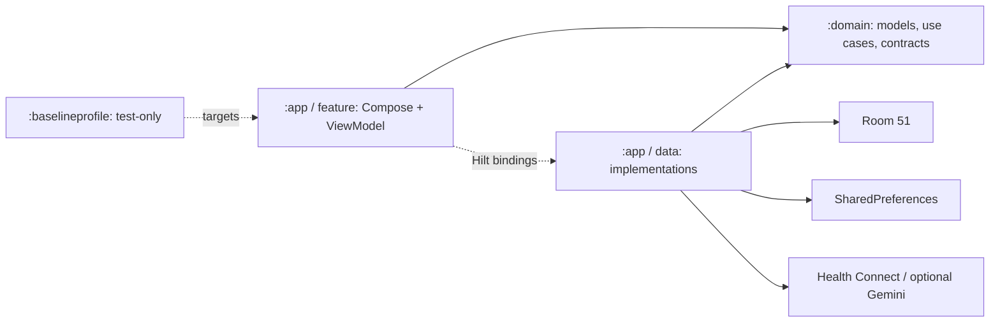

# Architecture Entry Map

THE SYSTEM: LEVEL UP. Перевірено 2026-09-18/19 за кодом ревізії
`184c0044718e22b97d01cee20f0da707a355c8bc`. Це карта реалізації, не специфікація бажаного продукту.

## Як читати

1. Прочитай цю карту, потім потрібний рядок у [FEATURE_MAP](docs/architecture/FEATURE_MAP.md).
2. Відкрий лише відповідний playbook, use case, repository/DAO, ViewModel/UI та тести.
3. Зістав карту з поточною ревізією й локальним diff; при розбіжності перевір конкретну ділянку.
4. Після зміни контрактів, потоків, навігації або persistence онови відповідну частину карти.

Не обов'язкові для кожної дрібної задачі:
- [PROJECT_AUDIT](PROJECT_AUDIT.md): докази, ризики, оцінки та актуальні зовнішні вимоги.
- [DEVELOPMENT_ROADMAP](DEVELOPMENT_ROADMAP.md): порядок робіт і критерії приймання.
- [PRODUCT_STRATEGY](PRODUCT_STRATEGY.md), [MVP_DEFINITION](MVP_DEFINITION.md): продуктовий намір; реалізацію звіряй із картою.

## Продукт і модулі

Задум: щоденне рішення -> виконання -> запис -> доказ прогресу -> наступне рішення.
Реалізовано локальний fitness/RPG-додаток, без обов'язкового акаунта або AI.
Користувацької бази ще немає; існуючі дані розробника все одно не можна знищувати.

Стрілки до `:domain` означають compile-time залежність; repository interfaces живуть у domain.
Runtime: Compose -> ViewModel -> use case -> repository interface -> injected implementation -> DAO/API.
`:domain` не залежить від Android/Room/Compose. `:app` містить UI та data з різною відповідальністю.
`:baselineprofile` містить генерацію профілів та macrobenchmarks, не production behavior.

Скорочення шляхів:
- `A` = `app/src/main/java/com/ihor/thesystem/`
- `D` = `domain/src/main/java/com/ihor/thesystem/domain/`
- `T` = `app/src/test/kotlin/com/ihor/thesystem/`
- `I` = `app/src/androidTest/java/com/ihor/thesystem/`

## Запуск і DI

- `A/TheSystemApp.kt`: application scope, lazy image loader, відкладене планування DailyResetWorker.
- `A/MainActivity.kt`: edge-to-edge, тема, NavHost.
- `A/core/navigation/AppEntryViewModel.kt` -> `D/usecase/OnboardingUseCases.kt`: route за onboarding flag.
- `A/core/navigation/AppNavGraph.kt`, `Routes.kt`: navigation, Scaffold/insets, tab swipes.
- `A/core/di/DatabaseModule.kt`: Room + migrations + async seed + DatabaseReadiness.
- `A/data/local/room/database/DatabasePopulator.kt`: singleton player/config, exercise assets, metadata version gate.
- `A/core/di/RepositoryModule.kt`: domain contracts -> implementations, включно з preferences.
- `A/core/di/AiModule.kt`: AI/analytics/live coach bindings і Gemini configuration.
- `NetworkModule.kt`, `DispatcherModule.kt`, `AppScopeModule.kt`, `TextProviderModule.kt` у тій самій DI-директорії.

Готовність БД і завершення onboarding є різними станами.
Seed не створює готовий тренувальний розклад. Metadata version = 1, expected core rows = 120.

## Навігація

| Route | Екран у `A/feature/` | Owner |
| --- | --- | --- |
| Onboarding, поза bottom tabs | `onboarding/ui/OnboardingScreen.kt` | OnboardingViewModel -> CompleteOnboardingUseCase |
| Status | `status/ui/StatusScreen.kt` | StatusViewModel -> GetStatusScreenDataUseCase / DecideTodayWorkoutUseCase |
| Calendar | `calendar/ui/CalendarScreen.kt` | CalendarViewModel -> date summary / calendar cycle / todos |
| Cycle, підпис System | `cycle/ui/CycleScreen.kt` | WorkoutViewModel + StatusViewModel; schedule editor, active workout |
| Statistics | `statistics/ui/StatisticsScreen.kt` | StatisticsViewModel -> GetStatisticsDataUseCase |
| Profile | `profile/ui/ProfileScreen.kt` | StatusViewModel; WorkoutViewModel для settings/backup |

Secondary routes: Architect, CalendarSettings, AnnualProgressionPlan, AnnualProgressionDetails,
WorkoutAnalysis(sessionId), ExercisePicker(source, cycleDay).
Today Order CTA веде на Cycle; діалог тренування відкривається там.
ExercisePicker перевикористовується для циклу й річного плану.

## Runtime-потоки

| Сценарій | Файли у `D/usecase/` | Важлива межа |
| --- | --- | --- |
| Перший запуск | `OnboardingUseCases.kt` | player/equipment/config у Room; completion у prefs |
| День | `SyncTodayStateUseCase.kt`, `FinalizeDayUseCase.kt`, `GenerateDailyQuestsUseCase.kt` | foreground + worker, clock, quests |
| Today Order | `DecideTodayWorkoutUseCase.kt`, `CalculateReadinessUseCase.kt`, `CalculateRecoveryDebtUseCase.kt` | schedule + calendar override + readiness/HC + history |
| Навантаження | `CalculateRecommendedSetUseCase.kt`, `AdjustWorkoutRecommendationUseCase.kt` | equipment, history, matrix, decision |
| Finish | `FinalizeSessionUseCase.kt`, `CompleteQuestUseCase.kt` | log/progression/XP commit; потім report і AI validation |
| Edit sets | `StatisticsUseCases.kt`, `LogWorkoutSetsUseCase.kt` | edit вимагає explicit sessionId + exerciseId; Room замінює тільки target sets і перераховує session tonnage |
| Statistics | `GetStatisticsDataUseCase.kt`, `GetAnnualProgressionDetailsUseCase.kt` | bounded logs, weights, plans, quests |
| AI | `SendArchitectAnalysisUseCase.kt`, `ApplyAiRecommendationsUseCase.kt`, `ValidateDirectivesUseCase.kt` | AI пропонує, domain допускає зміни |
| Backup | `BackupUseCases.kt` | preview/confirm, Room transaction; prefs поза payload |
| Beta | `GetBetaMetricsUseCase.kt`, `BetaMetricsAggregator.kt` | локальні snapshots + logs, не зовнішня аналітика |

## Persistence

`A/data/local/room/database/AppDatabase.kt`: `the_system_db`, schema **51**, exportSchema=true.
Міграції: `DatabaseMigrations.kt`; підтримуваний pre-release floor **48**.
Еталон: `app/schemas/com.ihor.thesystem.data.local.room.database.AppDatabase/51.json`.

28 таблиць:
- Профіль: `player`, `weight_log`, `equipment_profile`, `nutrition_entries`.
- Система: `system_config`, `calendar_cycle_config`, `calendar_cycle_day`, `readiness_entries`, `todo`.
- Каталог/розклад: `exercises`, `daily_task_template`, `workout_templates`, `workout_exercise_cross_ref`, `schedule`, `schedule_task_cross_ref`.
- Виконання: `workout_sessions`, `exercise_sets`, `workout_session_logs`, `exercise_set_logs`, `workout_directives`, `exercise_milestones`.
- Прогрес/квести: `progression_matrix`, `reference_matrix`, `protocol_template`, `quest`, `quest_task`, `quest_log`.
- AI: `chat_message_table`.

Фактичні FK з CASCADE тільки три: `exercise_sets -> workout_sessions`,
`exercise_set_logs -> workout_session_logs`, `calendar_cycle_day -> calendar_cycle_config`.
Інші зв'язки через ID/Room relations логічні, не гарантії SQLite.
Поточний finish/statistics flow використовує `*_logs`; паралельні `workout_sessions/exercise_sets`
не видаляти без перевірки всіх читачів, backup та schema.

DAO у `A/data/local/room/dao/`: Player, WeightLog, EquipmentProfile, Nutrition,
SystemConfig, CalendarCycle, Readiness, Todo, Workout, Schedule, WorkoutAnalytics,
ProtocolTemplate, ProgressionMatrix, Quest, QuestLog, Chat (суфікс `Dao.kt`).
Contracts: `D/repository/`; implementations: `A/data/repository_impl/`.

Поза Room: onboarding completion, beta events, backup timestamps у SharedPreferences;
selected date та незавершені workout edits зараз у пам'яті.
Android backup виключає DB, але не ці preferences: відомий restore gap, не бажана архітектура.

## Зовнішні сервіси й UI

- Health Connect: лише `READ_SLEEP`; інші health permissions для поточного loop не потрібні.
- Gemini release: key порожній, client AI disabled у `app/build.gradle.kts`; є локальний report.
- Немає Firebase/Amplitude/Segment або обов'язкового account backend.
- Manual readiness/nutrition write UI не підключений до наявних domain/data моделей.

UI: `A/core/theme/SystemTokens.kt`, `Theme.kt`, `Color.kt`, `Dimensions.kt`, `Type.kt`;
`A/core/ui/components/SystemPanels.kt`, `SystemGlassComponents.kt`, `SystemBottomNavBar.kt`,
`SystemDialogComponents.kt`; `A/presentation/common/components/RpgStatusBackdrop.kt`.
Ефекти тільки через shared tokens/primitives, native Compose. Правила: `UI_UX_GUIDELINES.md`.

## Перевірки

| Зміна | Мінімальна перевірка |
| --- | --- |
| Docs | `scripts/check-doc-only.cmd`, diff |
| Kotlin/UI | `scripts/check-quick.cmd`, focused tests; UI також runtime |
| Domain/state | `scripts/check-tests.cmd` або targeted tests + повний gate перед release |
| Room | `scripts/check-room.cmd` + schema/migration та реальні Room instrumented tests |
| Native UI policy | `scripts/check-web-ui-guard.cmd` |
| Release | `:app:lintDebug`, `:app:bundleRelease`; не заміняють signed-device verification |

CI: `.github/workflows/android-ci.yml`, один Linux job, без connected UI/migration tests.
JDK17, Gradle9.3.1, AGP9.1.1, Kotlin2.1.0; min26/target36/compile36.
Domain unit tests зараз у `T/domain/`, не окремому `:domain:test` suite.

## Відомі ризики

Не вважай проблеми виправленими через наявність документації:
- AUD-01 закрито P01: evidence `docs/implementation/evidence/P01.md`; AUD-02: resume очищає workout draft.
- AUD-03/04: finish без стійкої idempotency; backup merge/restore не узгоджений.
- AUD-05/06: onboarding не дає schedule; neutral readiness прихований за впевненим текстом.
- AUD-07/08/09: REST/quest розходження, lint error, відсутній HC rationale entry.

Докази й наступні файли: [audit](PROJECT_AUDIT.md), [roadmap](DEVELOPMENT_ROADMAP.md).
Playbooks: `docs/playbooks/BUGFIX.md`, `NEW_FEATURE.md`, `ROOM_CHANGE.md`, `UI_POLISH.md`.
Пакет адресних задач за аудитом: [IMPLEMENTATION_PROMPTS](IMPLEMENTATION_PROMPTS.md); читати лише обраний prompt, не весь пакет.
