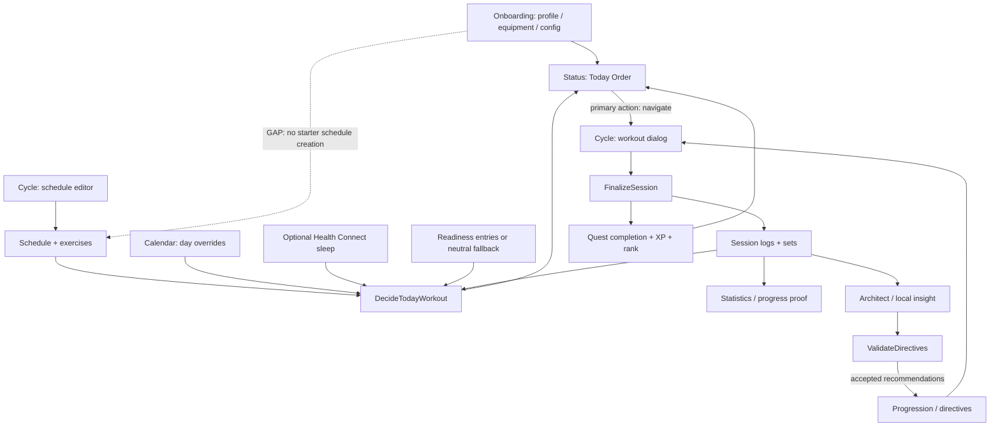
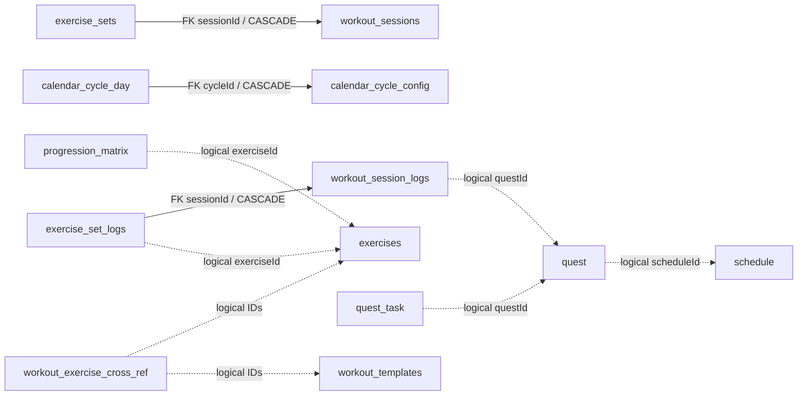
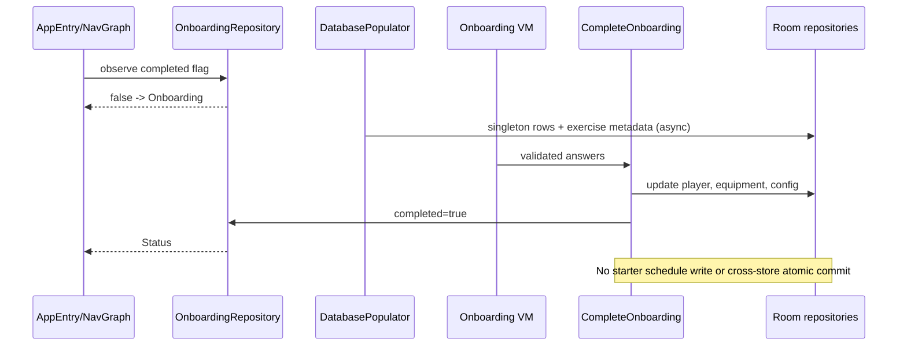
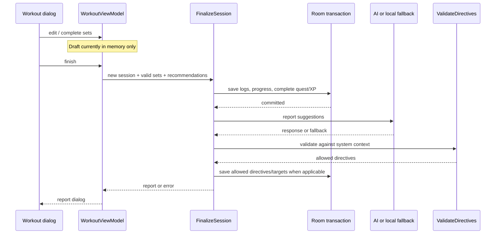

# Feature And Data Flow Map

Перевірено 2026-09-18/19, код `184c0044718e22b97d01cee20f0da707a355c8bc`.
Ця карта деталізує [GRAPH_REPORT](../../GRAPH_REPORT.md), а не замінює код.
Проблеми мають ID з [PROJECT_AUDIT](../../PROJECT_AUDIT.md).

## Легенда

- `A` = `app/src/main/java/com/ihor/thesystem/`
- `D` = `domain/src/main/java/com/ihor/thesystem/domain/`
- `T` = `app/src/test/kotlin/com/ihor/thesystem/`
- `I` = `app/src/androidTest/java/com/ihor/thesystem/`
- Шлях після префікса є точним шляхом у репозиторії.
- «Реалізовано» означає простежений code path, не гарантію runtime-якості.
- «Частково» означає незамкнену взаємодію; не всю функцію слід переписувати.

## Суть продукту

Локальна система щоденного вибору тренування, виконання й прогресу з RPG-подачею.
Status відповідає «що сьогодні», Cycle відповідає «як виконати/налаштувати», Calendar
відповідає «коли», Statistics відповідає «що змінилося», Profile відповідає «хто я/мої налаштування».
AI Architect є додатковим пояснювачем і джерелом пропозицій, а не власником тренувальної істини.

Остання пунктирна стрілка є відсутнім очікуваним зв'язком, не реалізованою функцією.
CalendarCycle day override і тренувальний Schedule є різними сутностями, не двома UI одного DAO.

## Реалізовані області

| Область | Що реально є | Стан / межа |
| --- | --- | --- |
| Onboarding | 5 кроків, ім'я/ціль/equipment/experience/cycle, completion route | Частково: config без starter schedule; completion поза Room |
| Status | player/XP, Today Order, quests, todos, рекомендація, режими | Реалізовано; decision warnings не повністю відображені |
| Today decision | recovery debt, readiness, calendar OFF/recovery, deload, no-excuse, training | Rule-based domain; не медична модель і не AI-прогноз |
| Cycle/System | редагування днів, вправи, picker, active workout | Реалізовано; тут виконується workout |
| Workout | inputs за tracking mode, completed flags, finish report | Draft in-memory; проблемні edit/finish paths, AUD-01..03 |
| Equipment | profile, allowed equipment, exercise substitution | Підключено до onboarding та recommendations |
| Exercise catalog | assets, переклади, versioned technique metadata | Каталог не дорівнює готовій програмі |
| Calendar | місяць/дата, денний summary, todos, cycle settings | Окремий day-type overlay; потрібні cross-feature тести |
| Quests/RPG | main/side quests, tasks, XP, streak, ranks, rollover | Один ACTIVE quest не нагороджується повторно; regeneration є окремим ризиком |
| Statistics | weekly summary, workout proof, weight/annual progression, beta block | Queries bounded; не кожен query повертає всю історію |
| Annual plans | local step-loading generation, manual editor, details | Окремий local flow; matrix та encoded plan note |
| Profile | player/body metrics, profile/avatar editing, settings | Shared StatusViewModel; settings через WorkoutViewModel |
| AI Architect | weekly insight, suggestions, fallback, history | Release Gemini disabled; частина модулів UI недоступна |
| Health Connect | availability/permissions, on-demand sleep | Лише READ_SLEEP; rationale entry не реалізований |
| Manual readiness | models, DAO/repository, calculation, reading | Частково: немає підключеного save/check-in UI |
| Nutrition | entry/DAO/repository/use cases, floor calculations | Частково: save use case без виклику з feature UI |
| Backup | JSON export, preview/confirmation, validation, transaction | Не повний перенос стану; partial merge/cascade ризик |
| Beta metrics | unique open/refresh days, decision/day, weekly counts | Local snapshots; не cohort analytics і не feedback channel |
| Background | DailyResetWorker та foreground refresh | Shared day sync; потрібні concurrency/time-boundary tests |

## Власники даних

| Джерело істини | Storage | Читачі й письменники |
| --- | --- | --- |
| Профіль | player, weight_log | Player use cases, Status/Profile, progression |
| Конфігурація | system_config, equipment_profile | onboarding, cycle/settings, decision |
| Програма | schedule, workout_templates, cross refs, exercises | Cycle editor, picker, GenerateDailyQuests, WorkoutViewModel |
| Calendar overlay | calendar_cycle_config, calendar_cycle_day | CalendarSettings, daily summary, Today decision |
| Readiness/nutrition | readiness_entries, nutrition_entries | decision/statistics; UI writes ще не завершено |
| Квести | quest, quest_task, quest_log | GenerateDailyQuests, CompleteQuest, rollover, status/stats |
| Виконання | workout_session_logs, exercise_set_logs | FinalizeSession, set editors, statistics, AI context |
| Навантаження | progression_matrix, reference_matrix, protocol_template, workout_directives | recommendations, finalization, validated AI, annual planner |
| Денний список | todo | status/calendar та daily summaries |
| AI history | chat_message_table | Architect repository/VM |
| Setup/metrics/backup status | SharedPreferences | onboarding, beta recorder, BackupRepositoryImpl |
| Тимчасовий стан | StateFlow/in-memory | selected date, dialogs, workout edits; не durable log |

Це вибрані зв'язки, не повний ERD. Суцільні стрілки перелічують **усі три** FK schema51.
Пунктирні зв'язки підтримує код. `@Relation` сам по собі FK не створює.

## Критичні послідовності

### First launch

Status очікує DatabaseReadiness; route flag не доводить наявності повного профілю/розкладу.
Часткові writes, повтор після аварії та prefs-only restore потребують окремих тестів.

### Workout finish

Дві транзакційні фази не є однією атомарною операцією. Error після першого commit не означає,
що workout не збережено. XP idempotency окремого quest не забезпечує session idempotency.

### Daily state and AI

Foreground refresh / DailyResetWorker -> SyncTodayState -> FinalizeDay або GenerateDailyQuests
-> repositories -> flows -> Status/Calendar/Statistics.
Worker не гарантує запуск рівно опівночі; foreground має наздоганяти пропущені дні.

Architect -> SendArchitectAnalysis -> AiArchitectRepository -> parser -> UI proposals.
ApplyAiRecommendations -> ValidateDirectives -> accepted matrix writes.
AnnualProgressionPlan має окремий локальний Generate/Save flow; не називати його віддаленим AI.

## Маршрути задач

Спочатку відкрий 2-4 entry files з потрібного рядка. Розширюй читання лише за залежностями.
Тести вже існують, якщо явно не позначено «додати»; скорочені test names шукай під `T`.

| Симптом / задача | Entry files | Перевірка |
| --- | --- | --- |
| Не той перший route | `A/core/navigation/AppEntryViewModel.kt`; `D/usecase/OnboardingUseCases.kt`; `A/data/repository_impl/OnboardingRepositoryImpl.kt` | `T/domain/usecase/OnboardingUseCasesTest.kt`; додати Room+prefs restore integration |
| Після setup немає тренування | `D/usecase/OnboardingUseCases.kt`; `D/model/Onboarding.kt`; `A/data/local/room/database/DatabasePopulator.kt` | onboarding tests + clean-install schedule/Today Order integration |
| Неправильне Today рішення | `D/usecase/DecideTodayWorkoutUseCase.kt`; `D/usecase/CalculateReadinessUseCase.kt`; `D/usecase/CalculateRecoveryDebtUseCase.kt` | `T/domain/usecase/DecideTodayWorkoutUseCaseTest.kt`; calculation tests |
| Текст/CTA не відповідає рішенню | `A/feature/status/viewmodel/TodayOrderUiMapper.kt`; `A/feature/status/ui/RpgTodayOrderBlock.kt`; `A/feature/status/ui/StatusScreen.kt` | `T/feature/status/viewmodel/TodayOrderUiMapperTest.kt`; route UI test |
| Неправильний день/опівніч | `D/usecase/SyncTodayStateUseCase.kt`; `D/usecase/FinalizeDayUseCase.kt`; `D/usecase/ResolveTrainingCycleDayUseCase.kt` | однойменні тести в `T/domain/usecase/`; timezone/concurrency cases |
| REST, але є workout quest | `D/usecase/GenerateDailyQuestsUseCase.kt`; `D/usecase/DecideTodayWorkoutUseCase.kt`; `A/feature/status/viewmodel/WorkoutViewModel.kt` | GenerateDailyQuests + decision tests; додати OFF cross-flow case |
| Втрата/дублі workout sets | `A/feature/status/viewmodel/WorkoutViewModel.kt`; `D/usecase/FinalizeSessionUseCase.kt`; `A/data/local/room/dao/WorkoutAnalyticsDao.kt` | WorkoutViewModelMappersTest; додати lifecycle/idempotency Room tests |
| Редагування однієї вправи | `D/usecase/LogWorkoutSetsUseCase.kt`; `D/usecase/StatisticsUseCases.kt`; `D/repository/WorkoutAnalyticsRepository.kt`; `A/data/local/room/dao/WorkoutAnalyticsDao.kt`; `A/data/repository_impl/ProgressionMatrixRepositoryImpl.kt` | explicit `sessionId + exerciseId`; `T/domain/usecase/LogWorkoutSetsUseCaseTest.kt`; `T/data/repository_impl/ProgressionMatrixRepositoryImplTest.kt`; `I/data/local/room/WorkoutAnalyticsEditIntegrationTest.kt` |
| XP/ранг/серія | `D/usecase/CompleteQuestUseCase.kt`; `D/model/PlayerProgressionPolicy.kt`; `D/usecase/RecalculateGlobalRankUseCase.kt` | однойменні tests у `T/domain/`; completed quest regeneration |
| Вправи/обладнання | `D/usecase/EquipmentProfileUseCases.kt`; `D/usecase/GenerateDailyQuestsUseCase.kt`; `A/feature/exercise_search/viewmodel/ExerciseSearchViewModel.kt` | EquipmentProfileUseCasesTest; ExerciseSearchViewModelTest |
| Calendar/settings | `A/feature/calendar/viewmodel/CalendarViewModel.kt`; `A/feature/calendar/viewmodel/CalendarSettingsViewModel.kt`; `D/usecase/GetDailySummaryForDateUseCase.kt` | CalendarSettingsViewModelTest; GetDailySummaryForDateUseCaseTest |
| Statistics/chart | `D/usecase/GetStatisticsDataUseCase.kt`; `A/feature/statistics/viewmodel/StatisticsViewModel.kt`; `A/data/local/room/dao/WorkoutAnalyticsDao.kt` | BuildProgressProofsUseCaseTest; WorkoutAnalyticsQueryGuardTest; SQL fixtures |
| Annual plan | `D/usecase/GenerateAnnualProgressionPlanUseCase.kt`; `D/usecase/SaveAnnualProgressionPlanUseCase.kt`; `D/usecase/GetAnnualProgressionDetailsUseCase.kt` | AnnualProgressionPlanViewModelTest; GetAnnualProgressionDetailsUseCaseTest |
| Profile/edit | `A/feature/profile/ui/ProfileScreen.kt`; `A/feature/status/viewmodel/StatusViewModel.kt`; `D/usecase/PlayerUseCases.kt` | PlayerUseCasesTest; PlayerProfileValidationPolicyTest; ProfilePerformanceGuardTest |
| Health Connect | `A/health/HealthConnectPermissions.kt`; `A/data/repository_impl/HealthConnectSignalsRepositoryImpl.kt`; `app/src/main/AndroidManifest.xml` | додати sleep/permission tests + real HC rationale launch |
| Backup | `D/usecase/BackupUseCases.kt`; `A/data/repository_impl/BackupRepositoryImpl.kt`; `A/feature/status/viewmodel/WorkoutViewModel.kt` | BackupUseCasesTest; BackupImportPolicyTest; додати Room round-trip |
| AI/error/fallback | `A/data/remote/ai/AiAvailability.kt`; `A/data/repository_impl/AiArchitectRepositoryImpl.kt`; `A/feature/architect/viewmodel/ArchitectViewModel.kt` | AiAvailabilityTest; AiErrorClassifierTest; ArchitectViewModelTest; FinalizeSessionUseCaseFallbackTest |
| AI mutation | `D/usecase/ValidateDirectivesUseCase.kt`; `D/usecase/ApplyAiRecommendationsUseCase.kt`; `D/usecase/FinalizeSessionUseCase.kt` | ValidateDirectivesUseCaseTest; ApplyAiRecommendationsUseCaseTest/GuardTest |
| Beta metrics | `D/usecase/BetaMetricsAggregator.kt`; `D/usecase/GetBetaMetricsUseCase.kt`; `A/data/repository_impl/BetaMetricsRepositoryImpl.kt` | `T/domain/usecase/BetaMetricsAggregatorTest.kt`; schedule/date fixtures |
| Seed/startup | `A/TheSystemApp.kt`; `A/core/di/DatabaseModule.kt`; `A/data/local/room/database/DatabasePopulator.kt` | DatabasePopulatorCoreMetadataTest/GuardTest; `:baselineprofile`; cold/first-install окремо |
| Insets/swipes | `A/core/navigation/AppNavGraph.kt`; `A/core/ui/components/SystemBottomNavBar.kt`; target screen | `I/ui/ResponsiveLayoutTest.kt`; додати real NavHost journey |
| Колір/матеріал | `A/core/theme/SystemTokens.kt`; `A/core/ui/components/SystemPanels.kt`; `A/core/ui/components/SystemGlassComponents.kt` | compile + screenshots; `docs/playbooks/UI_POLISH.md` |
| Room migration | entity/DAO + `A/data/local/room/database/DatabaseMigrations.kt`; `A/data/local/room/database/AppDatabase.kt` | check-room + `I/data/local/room/database/AppDatabaseMigrationTest.kt` |
| Build/release/lint | `app/build.gradle.kts`; `gradle/libs.versions.toml`; `.github/workflows/android-ci.yml` | compile/tests/lint/bundle; merged manifest + release BuildConfig |

## Правила змін

- Domain вирішує; UI відображає state і передає events. Не дублювати Today rules у Compose.
- Logs впливають на XP, recovery, annual history, beta metrics та AI context.
- Schedule впливає на quests, calendar, recommendations і planned/missed metrics.
- Seed version і Room schema version незалежні; seed не повинен перезаписувати user logs.
- Backup change має врахувати FK, prefs, export destination та route readiness разом.
- Зміна AI prompt без parser/validation/fallback tests є неповною.
- Source guards не доводять runtime correctness або відсутність glyph clipping.
- Не читати весь FEATURE_MAP для color-only task: це індекс, не великий обов'язковий prompt.

## Підтримка карти

Оновлюй ревізію лише після перевірки відповідних частин. Неверифіковані області позначай явно.
Новий файл додай у routing row; не дублюй код. Після task зафіксуй зміну контракту й tests.
Аудит не стає актуальним автоматично після виправлень. Жодна карта не замінює diff і тести.
